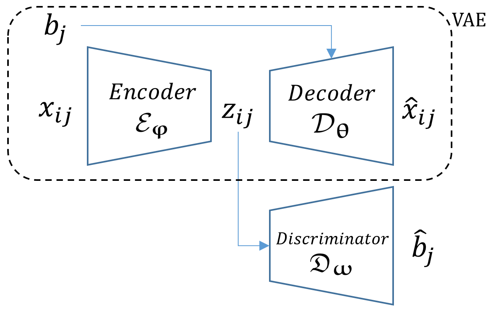

# Single Cell Generative Adversarial Network (scGAN)

Single-cell Generative Adversarial Network (scGAN). The variational autoencoder (VAE) component of the scGAN model consists of the Encoder and Decoder networks. The Encoder projects each single-cell gene expression profile onto a low dimensional embedding. The Decoder takes the embedding as input and predicts the sufficient statistics of the Negative Binomial data likelihood of the scRNA-seq counts. The Discriminator, being trained adversarially alongside the Encoder network, predicts the batch effects using as input the Encoder's embedding. Encoder, Decoder and the Discriminator are all parametric neural networks with learnable parameters.

Please go inside the scripts folder to run scGAN on the datasets we demonstrated in our paper.

Access to the scRNA-seq data used in this paper is described in the data folder
